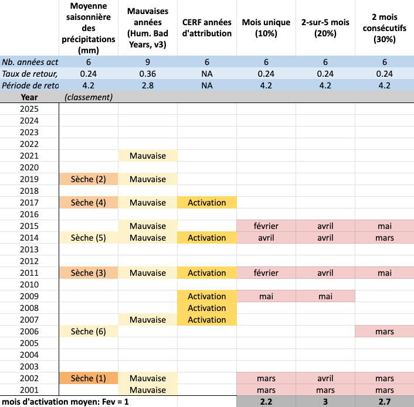

# Choisir les Protocoles Finaux 

## Les options sont présentées ci‑dessous 

## **NOUS METTONS À JOUR LES OPTIONS SUR LA BASE DE LA DISCUSSION DE LA DERNIÈRE RÉUNION**

Le tableau présente les options sous forme de colonnes, comparées aux crises humanitaires et aux années de plus faible pluviométrie. 

L’analyse présentée dans ce tableau repose désormais sur une période historique de 25 ans, afin d’évaluer plus précisément la fréquence des activations.

De plus, conformément aux échanges avec l’ONM, le mois de juin a été retiré des mois pouvant déclencher, car une activation à cette date serait trop tardive pour permettre une action anticipatoire utile.

Deux approches sont présentées :   
	- Une approche consiste à permettre à n’importe quel mois de déclencher, puis à réduire la fréquence pour tous les mois jusqu’à atteindre environ 30 % par an.   
	- L’autre approche consiste à exiger qu’au moins trois mois déclenchent parmi les cinq mois de prévisions. 

Points à garder en tête :   
	- Chaque protocole combiné est réglé à environ 30 % par an.  
	- Les différents protocoles peuvent déclencher dans des années différentes, ce qui entraîne des niveaux de précision différents.  
	- Les différents protocoles peuvent déclencher plus tôt ou plus tard dans l’année, donnant des délais de préparation différents. 

## Facteurs importants à considérer lors du choix d’un protocole

- **Précocité du déclenchement **  
Le moment où le déclenchement se produit influence directement le délai disponible pour mettre en œuvre 	des actions anticipatoires.
- **Années présentant des prévisions de sécheresse**   
Les différents protocoles identifient des années différentes comme répondant à la condition de sécheresse.

## Déclenchement sur un seul mois (10 %)

- Nécessite **un seul mois** présentant une prévision de sécheresse extrême.
- La condition est remplie **immédiatement**, sans mois de vérification.
- Cette option conduit généralement à des déclenchements plus précoces.

## Déclenchement sur deux mois consécutifs (30 %)

- Nécessite **deux mois consécutifs** présentant des prévisions de sécheresse (moins extrêmes que pour 	le seuil d’un seul mois).
- Inclut un mois de vérification, ce qui allonge le temps nécessaire avant que la condition soit remplie.
- Cette option conduit généralement à des déclenchements plus tardifs dans la saison.

## Note sur le calendrier

- Le déclenchement intervient autour du 20ᵉ jour de chaque mois.
Par exemple, une « prévision de mars » correspond approximativement au 20 mars.
	
Veuillez examiner attentivement le tableau, en discuter, puis partager vos réflexions dans le formulaire ci‑dessous. 

<!-- ## **NOUS AVONS DÉSACTIVÉ LE FORMULAIRE EN ATTENDANT LA MISE À JOUR DES OPTIONS** 

<!-- comment out the real form until ready

 

-->

 

